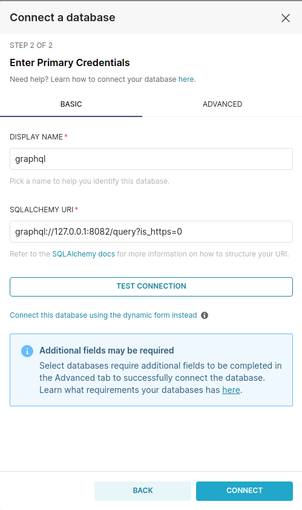

# graphql-db-api [](https://badge.fury.io/py/sqlalchemy-graphqlapi)  [](https://codecov.io/gh/cancan101/graphql-db-api)

A Python DB API 2.0 for Advantech APPs GraphQL APIs

This module allows querying GraphQL APIs using SQL and is compatible with Superset for GraphQL DB data sources.

## GraphQL API Examples  

For detailed examples, see the [graphql-db-api-example](https://github.com/lujin3/graphql-db-api-example) project.

## Installation

```bash
pip install git+https://github.com/lujin3/graphql-db-api
```

## SQLAlchemy Support

This module provides a SQLAlchemy dialect.

```python
from sqlalchemy.engine import create_engine

# Over HTTPS (default):
engine_https = create_engine('graphql://host:port/path')

# Over HTTP:
engine_http = create_engine('graphql://host:port/path?is_https=0')

# With a `Bearer` token in the `Authorization` header:
engine_http = create_engine('graphql://:token@host:port/path')
```

### Example Usage

```python
from sqlalchemy import create_engine
from sqlalchemy import text
from urllib.parse import urlencode

adapter_kwargs = {
    "headers": {
        "X-Ifp-Tenant-Id": "ffeb581c-6f23-43d2-b507-e224e04bc82d",
        "token": "xxxx",
    },
    "cookies": {
        "TSTenant": "ffeb581c-6f23-43d2-b507-e224e04bc82d",
        "EIToken": "xxxx"
    },
}

engine = create_engine(
    "graphql://127.0.0.1:8082/query?is_https=0", adapter_kwargs=adapter_kwargs
)

# Building the query string
query_string = urlencode(
    {
        "iarg_startTS": 1725850811000,
        "iarg_endTS": 1725957547000,
        "iarg_limit": 0,
    }
)

table = f"firefighting?{query_string}"
query = f"""SELECT ts AS ts,
       sum(value) AS "SUM(value)"
FROM '{table}'
WHERE ts >= 1627962437000
GROUP BY ts
ORDER BY "SUM(value)" DESC
LIMIT 1
OFFSET 0"""

with engine.connect() as connection:
    for row in connection.execute(text(query)):
        print(row)

```

## Superset Support

In order to use with Superset

1. install the package  

    ```python
    pip install git+https://github.com/lujin3/graphql-db-api
    ```  

2. Add the [db_engine_spec for graphql](https://github.com/lujin3/graphql-db-api/blob/main/graphqldb/graphql.py) for graphql to Superset:  
Copy the [db_engine_spec for graphql](https://github.com/lujin3/graphql-db-api/blob/main/graphqldb/graphql.py) to the  [superset db_engine_spec](https://github.com/apache/superset/tree/master/superset/db_engine_specs) directory.

3. Use the `graphql` protocol in the SQLAlchemy URI like: `graphql://127.0.0.1:8082/query?is_https=0`  

    

## Roadmap

- [x] Non-Connections top level
- [x] Path traversal (basic)
- [ ] Path traversal (basic + nested)
- [ ] Path traversal (list / connection)
- [x] Bearer Tokens in `Authorization` Header
- [ ] Advanced Auth (e.g. with token refresh)
- [ ] Passing Headers (e.g. Auth in other locations)
- [ ] Filtering
- [ ] Sorting
- [x] Relay Pagination
- [x] Authentication via headers (X-Ifp-Tenant-Id, token)
- [x] Authentication via cookies (TSTenant, EIToken)
- [x] Superset TimeGrain conversion support
- [x] Conversion of ts column to datetime type
- [x] Timeout support (default 300s)
